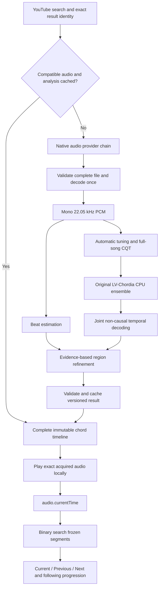

# Harmonia

**A Windows music player that analyzes a complete song before you listen, then follows playback with synchronized chords.**

Search for a song, choose a recording, and let Harmonia prepare its harmonic timeline. When preparation finishes, the player opens automatically with the current chord, neighboring chords, and a complete clickable progression. Seek anywhere: the harmony is already analyzed.

Harmonia combines a React interface, a Tauri/Rust desktop backend, local audio acquisition, and pretrained whole-song recognition. Audio analysis and storage happen locally. This repository includes the application, evaluation protocols, research history, regression tests, and measured limitations.

> **Current status:** a working Windows development checkpoint with verified search → preparation → playback, stable chord regions, and progression following. Recognition is still imperfect. Native inference currently requires the source checkout and its Python environment; the executable is **not yet a standalone, portable distribution**.

[Getting started](#getting-started-on-windows) · [Running Harmonia](#running-harmonia) · [How it works](#how-it-works) · [Recognition results](#recognition-and-performance) · [Troubleshooting](#troubleshooting) · [Documentation](#documentation)

## The experience

1. **Search while typing.** Real YouTube results update after a short debounce, with titles, channels, thumbnails, and durations where available.
2. **Select a recording.** Harmonia acquires the complete audio through its separate native provider chain.
3. **Prepare the whole song.** The entire recording is decoded and analyzed using past and future musical context.
4. **Freeze the timeline.** A complete, versioned sequence of chord regions exists before playback begins.
5. **Listen and navigate.** The exact analyzed audio plays locally. Current/Previous/Next, the highlighted progression, and follow-scroll share the same playback position.
6. **Return instantly.** Compatible cached audio and analysis are reused. Explicit corrections and re-analysis remain separate from normal playback.

The main experience includes play/pause, ±10-second controls, progress-bar seeking, chord-click seeking, a following progression strip, artwork, and song information. Manual progression scrolling briefly pauses following so you can explore upcoming harmony.

Additional features include local-file whole-song analysis, a persistent library, favorites, chord/boundary corrections, transposition and practice views, and analysis export. Windows **Listen Live** is preserved as an optional experimental mode; it is not the primary workflow.

**Practice tools are visible directly on the song page.** The Chord Library groups
the completed timeline's unique chords in first-appearance order, with appearance
counts, total duration and clickable occurrence times. Switch between guitar chord
boxes, piano voicings or both. **Song voicings** considers neighboring chords to
reduce hand movement, using 2,935 validated guitar grips and reachable piano layouts
with separate left/right hands. **Easy practice** offers explicit simpler shapes
and recommends a guitar capo when it makes the song easier. Sounding chord labels
remain visible; the piano stays in the song key. You can override the capo.

These are suggested arrangements, not verified original fingerings: a chord label
alone cannot establish which strings, register or instrument produced the recording.
Omitted notes and unavailable shapes are identified. Display transposition affects
practice views without changing the audio or saved analysis. See the
[voicing sources and limitations](docs/practical-voicing-sources.md) and
[Killer Queen recognition diagnosis](docs/killer-queen-diagnostic-report.md).

The current input bounds are **100 MiB per encoded recording and 20 minutes of audio**, with additional decoded-memory and runtime limits. Common local formats include WAV, FLAC, MP3 and Ogg; acquired M4A/WebM support depends on the Windows decoder. A file passing size checks is not a guarantee that every codec or maximum-length recording will succeed.

## Getting started on Windows

These instructions target **64-bit Windows 10/11 and PowerShell**. Run repository commands from the Harmonia root. Use `npm.cmd` to avoid PowerShell's `npm.ps1` execution-policy issue. No global JavaScript package installation is needed.

### Recommended: one-command startup

Download/extract this repository (or clone it), then double-click **Start-Harmonia.cmd**.
If Node is already installed, you can instead run this from the Harmonia folder:

```powershell
npm.cmd run desktop
```

The launcher checks and reuses compatible installations, prepares missing dependencies,
then starts the app. It handles Node, Rust/MSVC, C++ build tools and Windows SDK,
WebView2, Python 3.13, locked JavaScript/Python libraries, recognition weights and
the pinned local acquisition tools. You do not need to install libraries individually.

The first run needs internet access, can download several GB, and may request Windows
administrator approval. Compilation and installation can take a while; later runs reuse
the setup. Missing system tools are installed through Windows **App Installer / WinGet**.
If WinGet is absent, install App Installer from Microsoft Store and run again. A requested
Windows restart must be completed manually. This remains a source-based development app,
not a portable executable; native recognition needs **8 GiB available RAM**.

**YouTube search still needs your own YouTube Data API v3 key.** If none is configured,
the launcher offers a masked console prompt and saves it encrypted for your Windows
account. Enter it once; subsequent starts load it automatically. Press Enter to skip
and use local files. The launcher cannot create a Google Cloud key for you. Never share
your real `.env.local` or credential file with a friend.

Useful optional commands:

```powershell
npm.cmd run desktop:check                      # Check only; no installs or app window
npm.cmd run desktop:setup -- -NonInteractive   # Prepare dependencies without opening the app
npm.cmd run desktop:dev                        # Direct developer launch; bypass setup
```

The launcher has automated workflow tests and has been checked on the configured
development PC. Installation on a completely fresh Windows machine remains unverified.
The manual instructions below are a fallback and document the exact dependencies.

### 1. Install the system prerequisites

| Requirement                     | What to install / why                                                                                                                                                                                  |
| ------------------------------- | ------------------------------------------------------------------------------------------------------------------------------------------------------------------------------------------------------ |
| Git                             | [Git for Windows](https://git-scm.com/downloads/win), to clone and update the repository.                                                                                                              |
| Node.js + npm                   | [Node.js](https://nodejs.org/en/download), **24 or newer**. Recorded checkpoint: 24.11.1. Native test scripts also need Node 24's `node:sqlite`.                                                       |
| Rust + Cargo                    | Install with [rustup](https://rustup.rs/), using the stable **MSVC** Windows toolchain. Recorded checkpoint: Rust 1.97.1.                                                                              |
| Microsoft C++ Build Tools       | The **Desktop development with C++** workload, including MSVC tools and a Windows SDK, for native compilation.                                                                                         |
| Microsoft Edge WebView2 Runtime | The Evergreen Runtime, if absent. Tauri uses it to render the Windows interface.                                                                                                                       |
| Python                          | [64-bit Python 3.13](https://www.python.org/downloads/windows/) with `pip`, `venv`, and the Python launcher. Recorded checkpoint: 3.13.12. Required for current native recognition, not just training. |
| Memory                          | Recognition checks for **8 GiB available RAM** before starting. This is free memory, not installed capacity; maximum-length tracks and weaker PCs remain unvalidated.                                  |
| Google Chrome                   | Needed only for existing Playwright browser tests, which use the installed `chrome` channel.                                                                                                           |

Follow [Tauri's official Windows prerequisite guide](https://v2.tauri.app/start/prerequisites/#windows) for the C++ tools, WebView2, and Rust setup. Reopen PowerShell after installation so its `PATH` is refreshed.

```powershell
git --version
node --version
npm.cmd --version
rustc --version
cargo --version
py -3.13 --version
```

The primary recognizer runs on **CPU** with bounded threads. A training GPU, separate CUDA toolkit, Docker, FFmpeg, and a paid converter subscription are not required by the default path. Optional providers and separate research workflows may have additional requirements.

### 2. Clone and install JavaScript dependencies

For a new checkout:

```powershell
git clone --branch feat/harmonia https://github.com/YardenNitsan/Harmonia.git
Set-Location Harmonia
npm.cmd ci
```

`npm ci` installs the exact dependencies from `package-lock.json`: React, React DOM, TypeScript, Vite, Tauri's JavaScript API/CLI, Lucide icons, ONNX Runtime Web, and the test/lint/format tools. Do not install them individually or replace the lockfile to follow newer versions.

Cargo installs native dependencies during the first build using `apps/desktop/src-tauri/Cargo.lock`. These include Tauri, Tokio, Reqwest/Rustls, Serde, SHA-256 utilities, Windows APIs, and bundled SQLite through `rusqlite`. **No SQLite server or separate SQLite installation is required.**

### 3. Install the Python recognition environment

Create the environment at **`ml/.venv`**; the native application expects this location. The recorded Windows snapshot includes recognition and research/test libraries, so this is larger than a future inference-only package would need.

```powershell
py -3.13 -m venv ml/.venv
.\ml\.venv\Scripts\python.exe -m pip install --upgrade pip

# Match the PyTorch wheel recorded in the tested environment first.
.\ml\.venv\Scripts\python.exe -m pip install "torch==2.11.0+cu128" --index-url https://download.pytorch.org/whl/cu128

# Install all remaining exact runtime and research/test dependencies.
.\ml\.venv\Scripts\python.exe -m pip install -r ml/requirements-lock-win-py313.txt
.\ml\.venv\Scripts\python.exe -m pip check
```

The recorded Torch wheel includes CUDA support because the same environment was used for research; **Harmonia's selected native inference still uses CPU**. These commands reproduce that recorded environment. A smaller CPU-only package is not the environment behind the published measurements; do not silently replace pins when reproducing them. See [PyTorch's official installation guide](https://pytorch.org/get-started/locally/) for platform troubleshooting.

The complete version list is in [the Windows Python snapshot](ml/requirements-lock-win-py313.txt), with dependency groups in [pyproject.toml](ml/pyproject.toml). Main libraries installed by the snapshot:

| Group                       | Libraries                                                                                                           |
| --------------------------- | ------------------------------------------------------------------------------------------------------------------- |
| Model and numerical runtime | `torch`, `lv-chordia==1.1.0`, `numpy`, `scipy`, `psutil`                                                            |
| Audio/features              | `librosa`, `soundfile`, `soxr`, `numba`/`llvmlite`, `h5py`, `joblib`, `pydub`, `pretty_midi`, `mido`, `audioop-lts` |
| Evaluation/research         | `mir_eval`, `jams`, `scikit-learn`, `pandas`, `onnx`, `onnxruntime`                                                 |
| Checks                      | `pytest`, `ruff`, plus their locked transitive dependencies                                                         |

`audioop-lts` supplies compatibility for dependencies on Python 3.13. Installing the snapshot handles it automatically. Environment activation and editable installation of `harmonia-ml` are unnecessary for the documented entry points.

The pinned [LV-Chordia package](https://github.com/openmirlab/lv-chordia) ships five pretrained checkpoints. Harmonia verifies their hashes and does not download models during analysis or playback. Verify installation from the repository root:

```powershell
.\ml\.venv\Scripts\python.exe -c "import sys; from pathlib import Path; sys.path.insert(0, 'ml'); from harmonia_ml.inference.whole_song import verify_weights; verify_weights(Path(sys.prefix) / 'share/lv-chordia/cache_data'); print('All five LV checkpoints verified')"
```

Expected checkpoint, code, and package identities are in [the runtime manifest](ml/experiments/stabilization/results/runtime-manifest.json). Do not replace missing weights with an arbitrary model. No training corpus or new model training is needed to run the app.

### 4. Install local acquisition tools

The default provider uses pinned local **yt-dlp** and **Deno** executables. Provision them with the checksum-verifying script:

```powershell
powershell.exe -NoProfile -ExecutionPolicy Bypass -File scripts/prepare-acquisition-tools.ps1
powershell.exe -NoProfile -ExecutionPolicy Bypass -File scripts/prepare-acquisition-tools.ps1 -VerifyOnly
```

This installs reviewed tools under `%LOCALAPPDATA%\Harmonia\tools`, outside Git. It does not download a song or launch Harmonia. Pinned versions are yt-dlp **2026.08.19** and Deno **2.9.7**. The script-scoped execution-policy flag does not permanently change your PowerShell policy.

Harmonia prefers practical native formats such as M4A/AAC or WebM/Opus rather than converting everything to MP3. It validates and decodes the complete acquired file before inference. Format support depends on the platform decoder; unsupported or corrupt acquisitions are rejected.

Provider setup, hashes, and license implications are in [acquisition providers](docs/acquisition-providers.md). Tool availability does not guarantee access to every recording.

### 5. Configure YouTube search once

Create a Google Cloud project with **YouTube Data API v3 enabled**, obtain a key, and restrict it to that API. Search uses official `search.list` and `videos.list` endpoints; those APIs do not supply analysis PCM. Native requests cannot use browser-referrer key restrictions. See [search configuration](docs/youtube-configuration.md).

Create the ignored local file only if it does not already exist:

```powershell
if (-not (Test-Path -LiteralPath .env.local)) {
    Copy-Item -LiteralPath .env.example -Destination .env.local
}
```

Edit **`.env.local`**, not `.env.example`, and set:

```dotenv
YOUTUBE_API_KEY=your_local_key_here
```

For an optimized/release build, import the value into Windows protected storage:

```powershell
powershell.exe -NoProfile -ExecutionPolicy Bypass -File scripts/configure-youtube.ps1
```

This stores a DPAPI-protected key for the current Windows user at `%LOCALAPPDATA%\Harmonia\youtube-api-key.dpapi`. Existing protected configuration is preserved; use `-Replace` only when intentionally changing it, or `-Prompt` for masked entry.

Debug builds can read repository `.env.local`. **Release search does not read that file**: use protected setup or a runtime `YOUTUBE_API_KEY` environment variable. No key belongs in React, a `VITE_` variable, Git, or the ordinary search screen.

## Running Harmonia

### Desktop development

Run from the repository root; missing prerequisites are prepared automatically:

```powershell
npm.cmd run desktop
```

This starts Vite and opens the native Tauri window. The first Rust build takes longer while Cargo downloads and compiles dependencies. Use **Search & Analyze**, choose a result, wait for preparation, then listen. Local-file analysis is available as a secondary path without YouTube search credentials.

### Optimized Windows executable

Build the target directory used by the current acceptance probes:

```powershell
$env:CARGO_BUILD_JOBS = '2'
$env:CARGO_TARGET_DIR = Join-Path (Get-Location) 'apps/desktop/src-tauri/target/continuation-clean'
npm.cmd run desktop:build -- --no-bundle
```

Once the build succeeds, start it manually:

```powershell
& .\apps\desktop\src-tauri\target\continuation-clean\release\harmonia.exe
```

The executable is generated locally and is not committed. It currently locates the recognition script and Python environment in the checkout used to build it. **Keep that checkout in place; copying only the `.exe` to another computer is insufficient.** Rebuild after moving the source tree. Search configuration and acquisition tools are also per-user prerequisites.

`npm.cmd run desktop:build` without `--no-bundle` creates the configured NSIS installer, but portable Python/model deployment, signing, and clean-machine installation remain release gates. An installer build alone does not satisfy them. See [build and release notes](docs/build-release.md).

### Browser preview

```powershell
npm.cmd run dev
```

Open `http://localhost:1425`. This is useful for UI development and local browser tests. It does **not** provide native YouTube credentials/acquisition, Windows capture, or the native LV runtime; browser whole-song analysis retains the earlier DSP implementation. Use the desktop commands for the primary experience and current recognition quality.

## Optional provider configuration

The ranked chain is **local yt-dlp → private/self-hosted Cobalt → optional SaveAPI**. Providers have bounded retries, status-aware failover, rate-limit handling, and circuit health. Neither Cobalt nor a hosted subscription is required for the default local path.

To set up the optional private Cobalt fallback:

```powershell
powershell.exe -NoProfile -ExecutionPolicy Bypass -File scripts/cobalt-local.ps1 Prepare
powershell.exe -NoProfile -ExecutionPolicy Bypass -File scripts/cobalt-local.ps1 Start
powershell.exe -NoProfile -ExecutionPolicy Bypass -File scripts/cobalt-local.ps1 Status
```

Configure `COBALT_API_URL=http://127.0.0.1:19000/` in the native acquisition configuration. The helper uses pinned source and pnpm, starts a private local Node process, and does not start automatically with Harmonia. Stop that helper when no longer needed:

```powershell
powershell.exe -NoProfile -ExecutionPolicy Bypass -File scripts/cobalt-local.ps1 Stop
```

| Setting                             | Purpose                                                                                                                                                 |
| ----------------------------------- | ------------------------------------------------------------------------------------------------------------------------------------------------------- |
| `YOUTUBE_API_KEY`                   | Official search metadata; protected Windows setup described above.                                                                                      |
| `HARMONIA_YTDLP_PATH`               | Optional absolute override for the local yt-dlp executable.                                                                                             |
| `HARMONIA_JS_RUNTIME_PATH`          | Optional absolute override for Deno.                                                                                                                    |
| `COBALT_API_URL` / `COBALT_API_KEY` | Optional private Cobalt endpoint and credential, if required. Public `cobalt.tools` is not used.                                                        |
| `SAVEAPI_API_KEY`                   | Optional hosted fallback credential; hosted limits and terms apply.                                                                                     |
| `HARMONIA_RECOGNITION_PYTHON`       | Process-environment override for Python; it must contain compatible dependencies and verified weights. This does not relocate the internal script path. |

Acquisition settings are read natively from process environment, `%LOCALAPPDATA%\Harmonia\acquisition.env`, or discoverable repository `.env.local`, in that order. Use the per-user acquisition file for settings that must work regardless of launch directory. Provider names and credentials do not appear in the normal player flow. Details: [provider configuration and limitations](docs/acquisition-providers.md).

## How it works



**Recognition finishes before normal playback.** Seeking to an unheard part of the song immediately retrieves its existing chord. Playing, pausing, or seeking never replaces chord identities. Explicit corrections and re-analysis are deliberate operations, not background mutations.

The selected native path uses original LV-Chordia 1.1.0: full-song tuning/CQT, five pretrained networks with bidirectional context, and a joint HMM decoding root/quality, bass, sevenths, and upper extensions. Bass no longer bypasses temporal decoding as an independent frame-local slash label.

Conservative beat-supported refinement can merge brief weak decoration/bass contradictions when neighboring harmony and posterior evidence agree. It preserves strong changes and does not impose a fixed chord count or one chord per measure. There are no hardcoded progressions for particular songs. Scores remain **uncalibrated component support**, not reliable whole-chord probabilities.

Heavy work runs in workers and bounded native subprocesses, with cancellation, input/output limits, timeouts, and stale-result protection. Playback is independent of model execution. Native cache identities include source identity/fingerprint, pipeline, model, and profile; incompatible analyses are prepared again before playback. If audio has expired, it can be reacquired and checked against the saved fingerprint.

The original LV runtime is intentional: the experimental ONNX export has unresolved numerical-parity failures and is **not** the selected production path. E010 and other research artifacts are preserved. See [ADR010](docs/adr/010-native-whole-song-regions.md).

## Recognition and performance

The latest comparison uses the same 23,250 valid frames from five fixed HU33 validation compositions. No new training or locked-test evaluation was performed.

| Metric                   | Whole-song DSP baseline | Retained E010 | Selected native LV |
| ------------------------ | ----------------------: | ------------: | -----------------: |
| Root accuracy            |                  42.81% |        59.01% |         **62.66%** |
| Triad-quality accuracy   |                  46.28% |        58.86% |         **66.42%** |
| Seventh accuracy         |                  47.81% |        74.70% |         **78.02%** |
| Bass accuracy            |                  36.26% |        47.56% |         **53.52%** |
| Reduced structural exact |                   6.17% |        25.41% |         **39.86%** |

On the exact 151.424-second Bob Dylan regression recording:

| Measure                                 | Before |       After |
| --------------------------------------- | -----: | ----------: |
| Chord regions                           |  1,052 |      **67** |
| Median region duration                  |  46 ms |  **1.79 s** |
| Regions shorter than 200 ms             | 80.61% |      **0%** |
| Full analysis, including decode/startup | 1.42 s | **10.80 s** |

Selection-to-ready with the **original audio already cached** was **11.36 seconds**; reopening compatible analysis took **0.11 seconds** after selection. A seek directly to 2:00 displayed its precomputed chord in approximately **9 ms**. Network acquisition is not included in that 11.36-second measurement. The Bob recording has no reference annotation here; these are stability and latency observations, not a claimed accuracy score.

The improvement costs additional CPU time. Short-transition recall, inversions, diminished/augmented/suspended harmony, and advanced-chord recognition remain weak. The validation set has no positive 9/11/13 examples, so their recall cannot be established from it. Reliable downbeats, meter, local-key/modulation labels, and song sections remain open. These results do not establish broad-genre or low-end-hardware quality.

Read [the full comparison](docs/stabilization-model-comparison.md) and [Windows acceptance report](docs/stabilization-acceptance.md) for boundary precision/recall, class coverage, source hashes, timing breakdowns, and remaining failures.

## Repository structure

```text
apps/desktop/
  src/                    React interface and desktop composition
  src-tauri/              Rust commands, acquisition, recognition bridge, SQLite, WASAPI
packages/
  domain/                 Canonical chords, timelines, validation and lookup
  application/            Sessions, preparation, search and playback contracts
  audio/                  Decoding, workers, DSP and native-result assembly
  providers/              Search, audio, playback and native adapters
  persistence/            Repository implementations and serialization
ml/
  harmonia_ml/            Recognition runtime and retained research modules
  experiments/            Frozen protocols, comparison scripts and results
  artifacts/              Versioned export metadata and experimental artifacts
  tests/                  Numerical, training and inference regression tests
scripts/                  Setup helpers, runtime preparation and hidden native probes
tests/e2e/                Browser workflow and playback regression tests
docs/                    Architecture, ADRs, research, acceptance and operating guides
```

Domain code is independent of UI, databases, providers, and ML frameworks. Application/infrastructure layers keep search, acquisition, recognition, persistence, and playback replaceable without changing the chord model.

## Testing and contributing

From the repository root:

```powershell
# TypeScript and browser checks
npm.cmd test
npm.cmd run lint
npm.cmd run typecheck
npm.cmd run format:check
npm.cmd run build
npm.cmd run test:e2e:production

# Rust checks
cargo fmt --manifest-path apps/desktop/src-tauri/Cargo.toml -- --check
cargo test --manifest-path apps/desktop/src-tauri/Cargo.toml
cargo clippy --manifest-path apps/desktop/src-tauri/Cargo.toml --all-targets -- -D warnings

# Python checks, from ml/
Push-Location ml
.\.venv\Scripts\python.exe -m pytest -q
.\.venv\Scripts\python.exe -m ruff check .
.\.venv\Scripts\python.exe -m ruff format --check .
Pop-Location
```

Browser E2Es use installed Google Chrome and run headlessly. The checkpoint records **881 TypeScript tests, 42 production E2Es, 63 Rust tests, and 147 Python tests passing**. Full-tree Ruff has one documented pre-existing `SIM105` finding in preserved `experiments/e010_wasm_reference.py`; it is not a test failure or a clean-lint claim. Certain native live/network tests are deliberately opt-in.

The exact Bob native regression, on a configured machine with that original cached recording, is:

```powershell
node scripts/stabilization-native-probe.mjs docs/review-evidence/stabilization-local-new.json
```

Use a **new output path** each time. The probe opens an isolated hidden WebView, uses real search/native inference/local playback, verifies late seeking and cache reuse, and cleans up its owned state. It depends on the exact private cached audio documented in its source; it is not a fresh-clone fixture, and copyrighted test audio is not distributed. Do not overwrite retained acceptance reports.

Start with [AGENTS.md](AGENTS.md), [the implementation plan](docs/implementation-plan.md), and relevant [ADRs](docs/adr). Preserve experiment protocols and locked test sets; do not retrain completed studies or change tolerances to hide failures. Normal setup does not require acquiring a research dataset. Automated work should keep the visible GUI closed.

## Local data and privacy

| Location                                           | Contents                                                                    |
| -------------------------------------------------- | --------------------------------------------------------------------------- |
| `%APPDATA%\local.harmonia.desktop\harmonia.db`     | Native library, saved analyses, corrections and favorites.                  |
| `%APPDATA%\local.harmonia.desktop\acquired-audio\` | Bounded audio cache and source metadata.                                    |
| `%LOCALAPPDATA%\Harmonia\youtube-api-key.dpapi`    | Current-user protected search credential.                                   |
| `%LOCALAPPDATA%\Harmonia\acquisition.env`          | Optional native acquisition configuration; protect credentials stored here. |
| `%LOCALAPPDATA%\Harmonia\tools\`                   | Provisioned acquisition tools and optional private Cobalt checkout.         |
| `ml/.venv/`                                        | Local Python environment and installed pretrained weights; ignored by Git.  |
| `.env.local`                                       | Local developer configuration; ignored by Git.                              |

Search and acquisition require network access. Selected audio is analyzed locally; there is no automatic audio upload, telemetry, or training-data contribution. Configured remote acquisition fallbacks receive the selected recording request. Library data and credentials are separate from disposable test state. Audio eviction may require reacquisition; a library backup should include the database and any audio you need to retain.

## Troubleshooting

| Symptom                                             | Check                                                                                                                                                                                              |
| --------------------------------------------------- | -------------------------------------------------------------------------------------------------------------------------------------------------------------------------------------------------- |
| Search configuration is missing                     | Enable YouTube Data API v3; use `.env.local` for debug or run DPAPI setup for release under the same Windows user. Do not put keys in frontend code.                                               |
| Search works but preparation fails                  | Run acquisition setup with `-VerifyOnly`; check provider availability, recording restrictions and decoder support. Private Cobalt must be running if configured. Not every recording is available. |
| “Whole-song recognition is unavailable”             | Check `ml/.venv/Scripts/python.exe`, run `pip check` and checkpoint verification, confirm 8 GiB available RAM, and keep the build's checkout in place.                                             |
| PyTorch pin cannot be resolved                      | Install the recorded `+cu128` wheel from its explicit index before the snapshot; verify Python 3.13 x64 and package-index connectivity. Do not substitute versions and assume identical results.   |
| Python reports missing `audioop`                    | Install the complete snapshot, including `audioop-lts`, into the exact environment used by the app.                                                                                                |
| Native compilation cannot find a linker/SDK         | Install the C++ desktop workload and Windows SDK, use Rust's MSVC toolchain, then reopen the terminal.                                                                                             |
| `npm` is blocked by PowerShell                      | Use the documented `npm.cmd` commands.                                                                                                                                                             |
| Browser results differ from the desktop             | Browser preview uses older DSP; native LV recognition and acquisition require the Tauri app.                                                                                                       |
| Old chords appear after an intentional model change | Cache compatibility uses pipeline/model identities. Use explicit re-analysis when appropriate; playback itself never refreshes the timeline.                                                       |
| First build or analysis is slow                     | Initial downloads/compilation and Python/model startup add overhead. Measure full preparation separately from cached reopening.                                                                    |

## Documentation

| Topic                                              | Read                                                                                                        |
| -------------------------------------------------- | ----------------------------------------------------------------------------------------------------------- |
| Current executable and exact before/after evidence | [Stabilization acceptance](docs/stabilization-acceptance.md)                                                |
| Model comparison and advanced-class coverage       | [Recognition comparison](docs/stabilization-model-comparison.md)                                            |
| Product behavior                                   | [Product specification](docs/product-spec.md)                                                               |
| Architecture and decisions                         | [Architecture](docs/architecture.md), [ADRs](docs/adr)                                                      |
| Current work and historical checkpoints            | [Implementation plan](docs/implementation-plan.md), [final report](docs/final-report.md)                    |
| Native search credentials                          | [YouTube configuration](docs/youtube-configuration.md)                                                      |
| Acquisition setup, failover and licenses           | [Provider guide](docs/acquisition-providers.md), [acquisition acceptance](docs/acquisition-acceptance.md)   |
| Build, hidden validation and release gates         | [Build/release guide](docs/build-release.md)                                                                |
| Research protocols and measured failures           | [Training](docs/training.md), [evaluation](docs/evaluation.md), [dataset audit](docs/data/dataset-audit.md) |
| Remaining work                                     | [Known limitations](docs/known-limitations.md)                                                              |
| Optional Windows listening                         | [Live MVP evidence](docs/live-mvp.md)                                                                       |

Some older reports describe superseded product directions. The current flow is whole-song preparation followed by local playback, with ADR009 covering acquisition and ADR010 covering native recognition. Earlier experiments and failures remain available for reproducibility.

## Attribution and distribution

LV-Chordia builds on Junyan Jiang, Ke Chen, Wei Li, and Gus Xia's [Large-Vocabulary Chord Transcription via Chord Structure Decomposition](https://archives.ismir.net/ismir2019/paper/000078.pdf). Harmonia retains upstream model/software notices and documents its integration and evaluation separately.

See [retained notices](third-party/README.md), [ML notices](ml/third-party), and [acquisition notices](docs/licenses/acquisition). yt-dlp's Windows executable has GPLv3-or-later distribution obligations, Deno uses MIT, and Cobalt uses AGPL-3.0. These components are provisioned separately; their notices do not grant rights to recordings or override provider terms. Harmonia does not implement DRM, authentication, or protected-stream bypass.

The repository currently has no top-level application license file; the Rust manifest's MIT metadata is not a complete application distribution policy. Do not infer a public redistribution grant from dependency licenses. Portable runtime packaging, a complete license inventory, signing, and clean-machine installer validation remain open release work.
